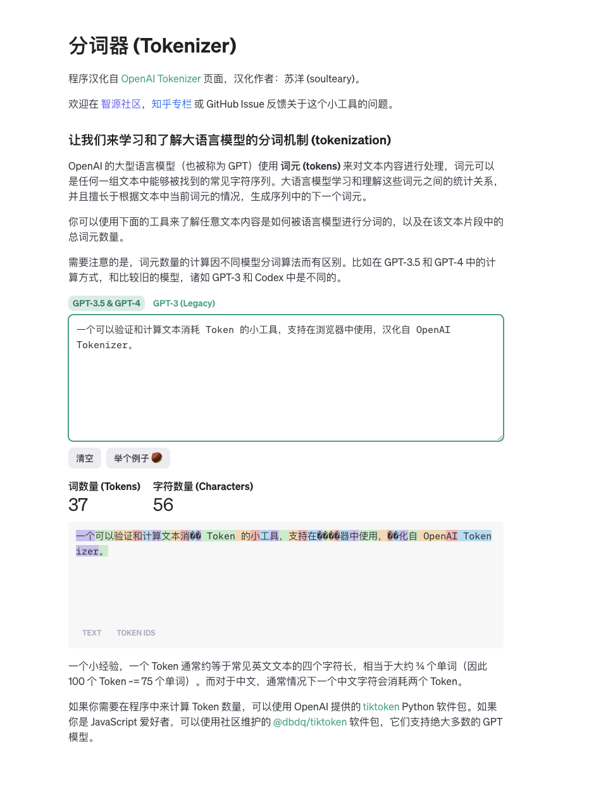
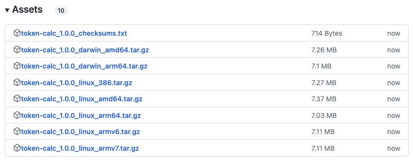
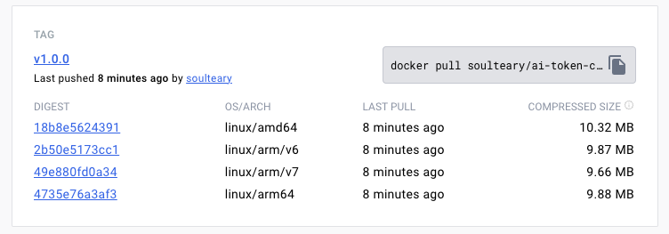

# AI 模型 Token 计算器

一个可以验证和计算文本消耗 Token 的小工具，支持在浏览器中使用，汉化自 [OpenAI Tokenizer](https://platform.openai.com/tokenizer)。

[](https://github.com/soulteary/ai-token-calculator)

## 页面预览



## 下载方式

**方式一：**

[](https://github.com/soulteary/ai-token-calculator/releases/)

在 [GitHub Release 下载页面](https://github.com/soulteary/ai-token-calculator/releases/)，找到适合你的操作系统的执行程序即可。

**方式二：**

[](https://hub.docker.com/r/soulteary/ai-token-calculator/tags)

```bash
docker pull soulteary/ai-token-calculator:v1.0.0
```

使用 Docker 下载 GitHub 自动构建好的镜像。

## 使用方式

使用方式有很多种。

### Docker

```bash
# 下载
docker pull soulteary/ai-token-calculator:v1.0.0
# 运行
docker run -p 8080:8080 soulteary/ai-token-calculator:v1.0.0 
```

然后打开浏览器访问 `localhost:8080` 就好啦。

你也可以使用下面的 Compose 文件，来启动容器。


```yaml
version: "3"

services:
  web:
    image: soulteary/ai-token-calculator:v1.0.0
    ports:
      - "8080:8080"
```

### Nginx

如果你更倾向使用 Nginx，你可以将项目下载到本地。

```bash
git clone https://github.com/soulteary/ai-token-calculator.git

cd ai-token-calculator
```

然后使用 Nginx 来快速使用这个项目，如果你使用 Docker，可以使用类似 [./docker-compose.nginx.yml](./docker-compose.nginx.yml) 中的方式：

```yaml
version: "3"

services:
  web:
    image: nginx:1.25.3-alpine
    volumes:
      - ./public:/usr/share/nginx/html
    ports:
      - "8080:80"
```

启动 Nginx 之后，访问浏览器即可。
